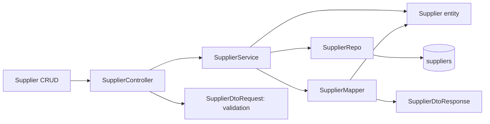
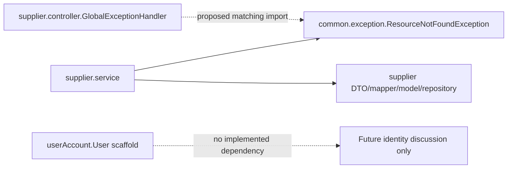

# Slice 0 proposed impact, architecture and change map

Revision 1; application changes proposed only. Source inspection confidence: high for explicit imports/calls/fields; runtime confidence incomplete until PostgreSQL/HTTP checks. Knowledge graph available: false; map derived directly from source. Scope derives from the owner's Slice 0 directive and draft requirements, not an approved baseline.

## Requirement lineage

| Requirement | Decision | Proposed issue unit (not created) | Files/classes | Migration/DB | API/service/repository | Tests | Verification |
|---|---|---|---|---|---|---|---|
| REQ-S0-001 | DEC-S0-003 | IU-S0-A baseline startup/build | mvnw.cmd; context/profile/guard | Existing V1 only | Startup, then Supplier routes | TC001/002/010 | Pending wrapper/package |
| REQ-S0-002 | DEC-S0-001/002 | IU-S0-A | User; context/profile/guard | Isolated DB, no new migration | No User endpoint | TC003/010/011 | Pending DB/startup |
| REQ-S0-003 | DEC-S0-004 | IU-S0-B Supplier API baseline | Existing flow; service/MVC/integration tests | suppliers unchanged | Five flows below | TC002/004/005/010 | Pending HTTP/persistence |
| REQ-S0-004 | DEC-S0-004 | IU-S0-B | GlobalExceptionHandler; MVC/integration tests | None | Common exception -> advice -> ApiError | TC006/008/009 | Pending error checks |
| REQ-S0-005 | DEC-S0-004 | IU-S0-B | SupplierDtoRequest; MVC/integration tests | name VARCHAR255 unchanged | POST/PUT validation before service | TC004/007 | Pending boundaries |
| REQ-S0-006 | DEC-S0-002 | IU-S0-A/C | Test guard/profile; preservation records | New isolated DB, retained | Test initialization only | TC003/011/012 | Source snapshot recorded; guard pending |
| REQ-S0-007 | DEC-S0-002/004 | IU-S0-C verification/documentation | README; governance; code-reading-guide | Document no FK changes | Actual contract/read order | TC010/012/013 | Draft records created; final evidence pending |

TC short IDs in this table mean `TC-S0-NNN`. Actual GitHub Issue URL/number: **none** for all rows. On requirement approval, populate issue links and approved requirement hash/revision; on implementation, add observed file/migration/test/result links rather than treating this proposal as completed work.

## Proposed implementation file actions

Paths relative to project root. `J` below means `src/main/java/com/project/app/`; `T` means `src/test/java/com/project/app/`. They are abbreviations only, not new directories.

| Action | Exact path | Reason / business concept | Dependencies / tests |
|---|---|---|---|
| Modify | `mvnw.cmd` | Restore existing script / development baseline | .mvn/wrapper properties; TC001/002/010 |
| Modify | `J/userAccount/model/User.java` | Remove JPA mapping only, retain source / unfinished identity scaffold | Lombok only after repair; no runtime consumers; TC003/012 |
| Modify | `J/supplier/controller/GlobalExceptionHandler.java` | Match common exception, targeted bad-input400 / Supplier API errors | Common exception, Spring MVC exceptions, ApiError; TC006/008/009 |
| Modify | `J/supplier/DTO/SupplierDtoRequest.java` | Size max255 / Supplier input | Jakarta validation; controller @Valid; TC007 |
| Modify | `T/supplier/service/SupplierServiceTest.java` | Assert actual entity name passed to save / Supplier update | Mockito, service/repo/mapper; TC002 |
| Modify | `T/AppApplicationTests.java` | Explicit isolated profile/guard and managed-model assertions / baseline schema | Guard, metamodel/Flyway/JDBC as available; TC003 |
| Create | `T/supplier/controller/SupplierControllerTest.java` | Targeted MVC/exception/validation checks / Supplier HTTP contract | WebMvcTest, mocked service, real advice/DTO validation; TC006-009 |
| Create | `T/supplier/SupplierApiIntegrationTest.java` | Full context MockMvc and real PostgreSQL / Supplier persistence | Guard/profile, real service/repo/mapper, transactional rollback; TC003-008 |
| Create | `T/support/Slice0DatabaseGuard.java` | Fail before DB initialization on unsafe target / test data protection | Spring ApplicationContextInitializer/environment; TC011 |
| Create | `T/support/Slice0DatabaseGuardTest.java` | Prove allowed/rejected targets without DB / test data protection | Pure JUnit + guard, no datasource; TC011 |
| Create | `src/test/resources/application-slice0-test.properties` | Explicit test URL/credentials, validate, Flyway no clean / safe test setup | PROCUREFLOW_TEST_DB_* env; TC003/011 |
| Modify | `README.md` | Accurate implemented/planned distinction and verified setup / study documentation | Actual commands/results, API table; TC010/013 |
| Modify | `.agile-v/requirements/slice-0.md` | Status/revision/approved baseline link only as authorized / requirements | Approval record; all TC |
| Modify | `.agile-v/decisions/slice-0.md` | Actual approvals/consequences / decision evidence | REQ/issue/test/result links |
| Modify | `.agile-v/traceability/slice-0.md` | Actual file actions and issue/test/result links / change map | Actual diff, not inferred completion |
| Modify | `.agile-v/tests/slice-0-test-plan.md` | Baseline binding and actual test method names / test design | Approved requirement snapshot |
| Modify | `.agile-v/verification/slice-0-results.md` | Observed commands/outcomes/reviewer / verification | Surefire reports, SQL/startup/HTTP outputs |
| Modify | `docs/code-reading-guide.md` | Completed slice before/after/read order / study notes | Actual classes, DB/API/test evidence |
| Modify | `.agile-v/STATE.md`, `.agile-v/APPROVALS.md`, `.agile-v/REQUIREMENTS.md` | Actual stage/gate/index transitions / workflow | Explicit scoped human approvals |
| Create after approval | `.agile-v/requirements/baselines/slice-0-r1/` | Immutable approved requirement + decision/test-plan/traceability companion copies and manifest / baseline evidence | Per-file SHA256 and approval reference; not created yet |
| Delete | None | No deletion required | Unused supplier exceptions retained |

Unchanged implementation references: `pom.xml`, `.mvn/wrapper/maven-wrapper.properties`, `mvnw`, `docker-compose.yml`, `application.properties`, V1 migration, SupplierController, SupplierService, SupplierRepo, Supplier, SupplierMapper, SupplierDtoResponse, ApiError and common exception. Touching an unplanned source requires an evidence-backed revision, not incidental cleanup.

## Feature architecture map

Entity is the model being persisted; it does not call the repository. The main sequence is Controller -> Service -> Repository -> table, with entity/DTO/mapper dependencies alongside it.

## Class dependencies and cross-module relations

| Component | Explicit dependency/use |
|---|---|
| AppApplication | Boot component/entity/repository scanning under com.project.app |
| SupplierController | Constructor SupplierService; request/response DTOs; Jakarta @Valid; ResponseEntity |
| SupplierService | Constructor SupplierRepo and SupplierMapper; Supplier fields; common ResourceNotFoundException |
| SupplierMapper | SupplierDtoRequest -> Supplier constructor; Supplier getters -> SupplierDtoResponse |
| SupplierRepo | JpaRepository<Supplier, Long>; generated Spring Data operations |
| Supplier | JPA entity/table/id/column mapping; no other entity association |
| GlobalExceptionHandler | Currently supplier-specific exception; proposed common exception; Spring validation/input/integrity exceptions -> ApiError |
| User | JPA + Lombok currently; proposed Lombok-only scaffold; no inbound references found |

The User box is not linked to Supplier at runtime. No Organization class exists; the future-discussion box is not implementation. Framework cross-boundary flow: MVC validation -> advice; service/repository exception -> advice. Existing advice remains in supplier/controller to avoid unnecessary package moves.

## Endpoint -> method -> query -> mapping -> authorization -> tests

Controller methods and service methods have the same names below.

| Endpoint | Method | Repository/query | DTOs/mapping | Authorization | Coverage |
|---|---|---|---|---|---|
| GET /api/suppliers | getAllSuppliers | findAll; SELECT suppliers, order unspecified | toDto each -> response list | None currently | Existing shouldGetAllSuppliers/shouldReturnEmptyListWhenNoSuppliersExist; TC004/005 |
| GET /api/suppliers/{id} | getSupplierById | findById; PK lookup | toDto -> response | None currently | Existing get/missing unit tests; TC004/006/008 |
| POST /api/suppliers | createSupplier | save; generated-ID insert | request -> toEntity -> save -> toDto | None currently; @Valid input rule | Existing shouldCreateSupplier; TC004/007/008 |
| PUT /api/suppliers/{id} | updateSupplier | findById, save; PK lookup/update | request -> setName -> save -> toDto | None currently; @Valid input rule | Existing update/missing unit tests strengthened; TC004/006/007/008 |
| DELETE /api/suppliers/{id} | deleteSupplier | findById, delete; PK lookup/delete | None | None currently | Existing delete/missing unit tests; TC004/006/008 |

These are inherited Spring Data operations, not custom query definitions. SQL form is conceptual; record actual provider SQL only if needed to explain observed behavior. Advice coverage TC009 additionally simulates integrity409/unexpected500 without destabilizing a real database.

## Database relationship record

- `Supplier -> other entity`: none. Cardinality: not applicable. Owning side: none. FK location: none. Reason: current Supplier stores only id/name.
- `User -> Organization`: no implemented relation. Cardinality: not enforced. Owning side: none. FK location: none. Reason: primitive organisationId scaffold has no JPA association/migration/Organization target.
- Added/changed relationships: none. New migration: none. V1/table shape unchanged. Do not describe the future one-organization-per-employee rule as an existing FK.

## Change risks

| Risk | Mitigation | Evidence |
|---|---|---|
| Tests hit normal DB | Reject unsafe target before datasource/Flyway; explicit profile | TC011 + actual target/results |
| Mockito update test passes without mutation | Assert saved entity name and actual PostgreSQL reread | TC002/004 |
| Broad error catch masks client400 | Specific cases plus MVC tests, preserving error shape | TC006-009 |
| Scaffold work lost | Remove mapping only, retain fields/class; fingerprint original | TC012 |
| New feature silently added | Compare actual diff to scope and requirement IDs | TC013 + review |

## This setup task: actual files created

Governance lineage: APR-SETUP-001 -> owner setup directive, not approved application requirements. Created `AGENTS.md`; `.agile-v/README.md`, `SKILLS.md`, `STATE.md`, `APPROVALS.md`, `REQUIREMENTS.md`; `decisions/README.md`, `decisions/slice-0.md`; `requirements/slice-0.md`; `traceability/slice-0.md`, `traceability/repository-baseline.json`, `traceability/skill-installation.json`; `tests/slice-0-test-plan.md`; `verification/slice-0-review.md`, `verification/slice-0-results.md`; and `docs/code-reading-guide.md`.

Reasons/concepts are the record roles above: workflow, skill provenance, requirements, decision rationale, source/change map, test proposal, verification evidence and study guide. Dependencies are Markdown links, not Java/runtime dependencies. No application endpoint/migration/authorization change was performed. Original planning documents were not edited; files deleted: none. Exact added skill files, source revisions and SHA256 are in [installation manifest](skill-installation.json). Existing spec skill is retained unchanged. Required source preservation evidence is in [repository snapshot](repository-baseline.json) and [results](../verification/slice-0-results.md).

After a completed implementation, replace proposal-only claims with actual file changes and preserve this original draft as part of the approved baseline/revision history.
