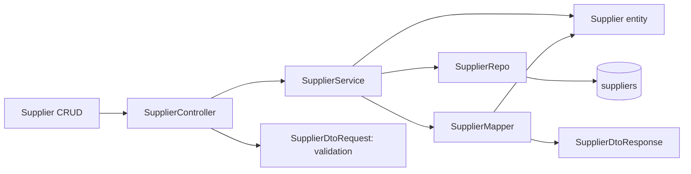
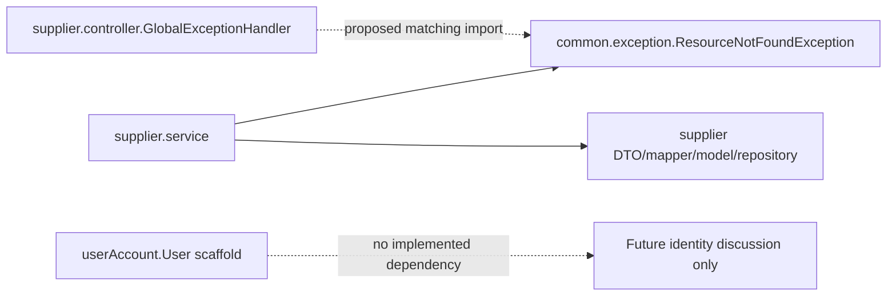

# Slice 0 impact, architecture and change map

Revision 1; application changes proposed only. Source inspection confidence: high for explicit imports/calls/fields; runtime confidence incomplete until PostgreSQL/HTTP checks. Knowledge graph available: false; map derived directly from source. Scope is approved as requirement revision 1 / BL-S0-R1 under GATE-S0-R1, 2026-10-10; application changes remain proposed, not implemented.

## Requirement lineage

| Requirement | Decision | Approved issue unit (implementation pending) | Files/classes | Migration/DB | API/service/repository | Tests | Verification |
|---|---|---|---|---|---|---|---|
| REQ-S0-001 | DEC-S0-003 | [#1 / IU-S0-A](https://github.com/anonymnd/procureflow-ai/issues/1) baseline startup/build | mvnw.cmd; context/profile/guard | Existing V1 only | Startup, then Supplier routes | TC001/002/010 | Pending wrapper/package |
| REQ-S0-002 | DEC-S0-001/002 | [#1 / IU-S0-A](https://github.com/anonymnd/procureflow-ai/issues/1) | User; context/profile/guard | Isolated DB, no new migration | No User endpoint | TC003/010/011 | Pending DB/startup |
| REQ-S0-003 | DEC-S0-004 | [#2 / IU-S0-B](https://github.com/anonymnd/procureflow-ai/issues/2) Supplier API baseline | Existing flow; service/MVC/integration tests | suppliers unchanged | Five flows below | TC002/004/005/010 | Pending HTTP/persistence |
| REQ-S0-004 | DEC-S0-004 | [#2 / IU-S0-B](https://github.com/anonymnd/procureflow-ai/issues/2) | GlobalExceptionHandler; MVC/integration tests | None | Common exception -> advice -> ApiError | TC006/008/009 | Pending error checks |
| REQ-S0-005 | DEC-S0-004 | [#2 / IU-S0-B](https://github.com/anonymnd/procureflow-ai/issues/2) | SupplierDtoRequest; MVC/integration tests | name VARCHAR255 unchanged | POST/PUT validation before service | TC004/007 | Pending boundaries |
| REQ-S0-006 | DEC-S0-002 | [#1](https://github.com/anonymnd/procureflow-ai/issues/1) / [#3](https://github.com/anonymnd/procureflow-ai/issues/3) | Test guard/profile; preservation records | New isolated DB, retained | Test initialization only | TC003/011/012 | Source snapshot recorded; guard pending |
| REQ-S0-007 | DEC-S0-002/004 | [#3 / IU-S0-C](https://github.com/anonymnd/procureflow-ai/issues/3) verification/documentation | README; governance; code-reading-guide | Document no FK changes | Actual contract/read order | TC010/012/013 | Draft records created; final evidence pending |

TC short IDs in this table mean `TC-S0-NNN`. Actual issues are linked above and bind to [BL-S0-R1 manifest](../requirements/baselines/slice-0-r1/manifest.json), which records all four approved companion hashes. On implementation, add observed file/migration/test/result links rather than treating this approved proposal as completed work.

## Proposed implementation file actions

Paths relative to project root. `J` below means `src/main/java/com/project/app/`; `T` means `src/test/java/com/project/app/`. They are abbreviations only, not new directories.

| Action | Exact path | Reason / business concept | Dependencies / tests |
|---|---|---|---|
| Modify | `mvnw.cmd` | Restore existing script / development baseline | .mvn/wrapper properties; TC001/002/010 |
| Modify | `J/userAccount/model/User.java` | Remove JPA mapping only, retain source / unfinished identity scaffold | Lombok only after repair; no runtime consumers; TC003/012 |
| Modify | `J/supplier/controller/GlobalExceptionHandler.java` | Match common exception, targeted bad-input400 / Supplier API errors | Common exception, Spring MVC exceptions, ApiError; TC006/008/009 |
| Modify | `J/supplier/DTO/SupplierDtoRequest.java` | Size max255 / Supplier input | Jakarta validation; controller @Valid; TC007 |
| Modify | `T/supplier/service/SupplierServiceTest.java` | Assert actual entity name passed to save / Supplier update | Mockito, service/repo/mapper; TC002 |
| Modify | `T/AppApplicationTests.java` | Explicit isolated profile/guard and managed-model assertions / baseline schema | Guard, metamodel/Flyway/JDBC as available; TC003 |
| Create | `T/supplier/controller/SupplierControllerTest.java` | Targeted MVC/exception/validation checks / Supplier HTTP contract | WebMvcTest, mocked service, real advice/DTO validation; TC006-009 |
| Create | `T/supplier/SupplierApiIntegrationTest.java` | Full context MockMvc and real PostgreSQL / Supplier persistence | Guard/profile, real service/repo/mapper, transactional rollback; TC003-008 |
| Create | `T/support/Slice0DatabaseGuard.java` | Fail before DB initialization on unsafe target / test data protection | Spring ApplicationContextInitializer/environment; TC011 |
| Create | `T/support/Slice0DatabaseGuardTest.java` | Prove allowed/rejected targets without DB / test data protection | Pure JUnit + guard, no datasource; TC011 |
| Create | `src/test/resources/application-slice0-test.properties` | Explicit test URL/credentials, validate, Flyway no clean / safe test setup | PROCUREFLOW_TEST_DB_* env; TC003/011 |
| Modify | `README.md` | Accurate implemented/planned distinction and verified setup / study documentation | Actual commands/results, API table; TC010/013 |
| Modify | `.agile-v/requirements/slice-0.md` | Status/revision/approved baseline link only as authorized / requirements | Approval record; all TC |
| Modify | `.agile-v/decisions/slice-0.md` | Actual approvals/consequences / decision evidence | REQ/issue/test/result links |
| Modify | `.agile-v/traceability/slice-0.md` | Actual file actions and issue/test/result links / change map | Actual diff, not inferred completion |
| Modify | `.agile-v/tests/slice-0-test-plan.md` | Baseline binding and actual test method names / test design | Approved requirement snapshot |
| Modify | `.agile-v/verification/slice-0-results.md` | Observed commands/outcomes/reviewer / verification | Surefire reports, SQL/startup/HTTP outputs |
| Modify | `docs/code-reading-guide.md` | Completed slice before/after/read order / study notes | Actual classes, DB/API/test evidence |
| Modify | `.agile-v/STATE.md`, `.agile-v/APPROVALS.md`, `.agile-v/REQUIREMENTS.md` | Actual stage/gate/index transitions / workflow | Explicit scoped human approvals |
| Create after approval | `.agile-v/requirements/baselines/slice-0-r1/` | Immutable approved requirement + decision/test-plan/traceability companion copies and manifest / baseline evidence | Per-file SHA256 and approval reference; created 2026-10-10 under GATE-S0-R1 |
| Delete | None | No deletion required | Unused supplier exceptions retained |

Unchanged implementation references: `pom.xml`, `.mvn/wrapper/maven-wrapper.properties`, `mvnw`, `docker-compose.yml`, `application.properties`, V1 migration, SupplierController, SupplierService, SupplierRepo, Supplier, SupplierMapper, SupplierDtoResponse, ApiError and common exception. Touching an unplanned source requires an evidence-backed revision, not incidental cleanup.

## Feature architecture map

Entity is the model being persisted; it does not call the repository. The main sequence is Controller -> Service -> Repository -> table, with entity/DTO/mapper dependencies alongside it.

## Class dependencies and cross-module relations

| Component | Explicit dependency/use |
|---|---|
| AppApplication | Boot component/entity/repository scanning under com.project.app |
| SupplierController | Constructor SupplierService; request/response DTOs; Jakarta @Valid; ResponseEntity |
| SupplierService | Constructor SupplierRepo and SupplierMapper; Supplier fields; common ResourceNotFoundException |
| SupplierMapper | SupplierDtoRequest -> Supplier constructor; Supplier getters -> SupplierDtoResponse |
| SupplierRepo | JpaRepository<Supplier, Long>; generated Spring Data operations |
| Supplier | JPA entity/table/id/column mapping; no other entity association |
| GlobalExceptionHandler | Currently supplier-specific exception; proposed common exception; Spring validation/input/integrity exceptions -> ApiError |
| User | JPA + Lombok currently; proposed Lombok-only scaffold; no inbound references found |

The User box is not linked to Supplier at runtime. No Organization class exists; the future-discussion box is not implementation. Framework cross-boundary flow: MVC validation -> advice; service/repository exception -> advice. Existing advice remains in supplier/controller to avoid unnecessary package moves.

## Endpoint -> method -> query -> mapping -> authorization -> tests

Controller methods and service methods have the same names below.

| Endpoint | Method | Repository/query | DTOs/mapping | Authorization | Coverage |
|---|---|---|---|---|---|
| GET /api/suppliers | getAllSuppliers | findAll; SELECT suppliers, order unspecified | toDto each -> response list | None currently | Existing shouldGetAllSuppliers/shouldReturnEmptyListWhenNoSuppliersExist; TC004/005 |
| GET /api/suppliers/{id} | getSupplierById | findById; PK lookup | toDto -> response | None currently | Existing get/missing unit tests; TC004/006/008 |
| POST /api/suppliers | createSupplier | save; generated-ID insert | request -> toEntity -> save -> toDto | None currently; @Valid input rule | Existing shouldCreateSupplier; TC004/007/008 |
| PUT /api/suppliers/{id} | updateSupplier | findById, save; PK lookup/update | request -> setName -> save -> toDto | None currently; @Valid input rule | Existing update/missing unit tests strengthened; TC004/006/007/008 |
| DELETE /api/suppliers/{id} | deleteSupplier | findById, delete; PK lookup/delete | None | None currently | Existing delete/missing unit tests; TC004/006/008 |

These are inherited Spring Data operations, not custom query definitions. SQL form is conceptual; record actual provider SQL only if needed to explain observed behavior. Advice coverage TC009 additionally simulates integrity409/unexpected500 without destabilizing a real database.

## Database relationship record

- `Supplier -> other entity`: none. Cardinality: not applicable. Owning side: none. FK location: none. Reason: current Supplier stores only id/name.
- `User -> Organization`: no implemented relation. Cardinality: not enforced. Owning side: none. FK location: none. Reason: primitive organisationId scaffold has no JPA association/migration/Organization target.
- Added/changed relationships: none. New migration: none. V1/table shape unchanged. Do not describe the future one-organization-per-employee rule as an existing FK.

## Change risks

| Risk | Mitigation | Evidence |
|---|---|---|
| Tests hit normal DB | Reject unsafe target before datasource/Flyway; explicit profile | TC011 + actual target/results |
| Mockito update test passes without mutation | Assert saved entity name and actual PostgreSQL reread | TC002/004 |
| Broad error catch masks client400 | Specific cases plus MVC tests, preserving error shape | TC006-009 |
| Scaffold work lost | Remove mapping only, retain fields/class; fingerprint original | TC012 |
| New feature silently added | Compare actual diff to scope and requirement IDs | TC013 + review |

## This setup task: actual files created

Governance lineage: APR-SETUP-001 -> owner setup directive, not approved application requirements. Created `AGENTS.md`; `.agile-v/README.md`, `SKILLS.md`, `STATE.md`, `APPROVALS.md`, `REQUIREMENTS.md`; `decisions/README.md`, `decisions/slice-0.md`; `requirements/slice-0.md`; `traceability/slice-0.md`, `traceability/repository-baseline.json`, `traceability/skill-installation.json`; `tests/slice-0-test-plan.md`; `verification/slice-0-review.md`, `verification/slice-0-results.md`; and `docs/code-reading-guide.md`.

Reasons/concepts are the record roles above: workflow, skill provenance, requirements, decision rationale, source/change map, test proposal, verification evidence and study guide. Dependencies are Markdown links, not Java/runtime dependencies. No application endpoint/migration/authorization change was performed. Original planning documents were not edited; files deleted: none. Exact added skill files, source revisions and SHA256 are in [installation manifest](skill-installation.json). Existing spec skill is retained unchanged. Required source preservation evidence is in [repository snapshot](repository-baseline.json) and [results](../verification/slice-0-results.md).

After a completed implementation, replace proposal-only claims with actual file changes and preserve this original draft as part of the approved baseline/revision history.

## Governance update - DIR-ROLES-001

2026-10-09, owner directive, maintained by Codex. Modified files: `AGENTS.md` (Codex/FCC responsibilities, existing-record handoff and review contract); `.agile-v/README.md` (role/review sequence); `.agile-v/STATE.md` (current responsibilities and unchanged pending gates); `.agile-v/APPROVALS.md` (actual role directive, not feature approval); this traceability file (change lineage). Reason/business concept: explicit implementation/review separation and preservation of the learning workflow. Dependencies: existing governance-document references only. Created/deleted files: none. Application classes, DB relationships/cardinalities/FKs, migrations, APIs, DTOs/mappers, authorization and implementation tests changed: none. `docs/code-reading-guide.md` and Slice 0 requirement/decision/test-plan contents are preserved. Verification: governance diff/whitespace check; no application behavior test required for this instruction-only update. No implementation review PASS, requirement approval or issue creation is inferred from assigning roles.

## Actual approval/baseline update - GATE-S0-R1

2026-10-10, owner "i approve slice 0", maintained by Codex. Requirement revision 1 and four normative companions are frozen byte-for-byte as BL-S0-R1. Snapshot files retain drafting-stage labels as historical content; the manifest/APPROVALS records establish approval without modifying acceptance.

Created under .agile-v/requirements/baselines/slice-0-r1/:
- requirement.md: approved requirement snapshot; Supplier/development baseline concept.
- decisions.md: approved technical-choice snapshot.
- test-plan.md: approved acceptance test/command snapshot.
- traceability.md: approved proposed file/dependency/API/database map.
- manifest.json: source paths, hashes, approval, checkpoint and wrapper source.
- .gitattributes: disable Git line-ending normalization within the frozen bundle so approved SHA-256 bytes survive publication/checkouts.

Modified:
- .agile-v/APPROVALS.md: actual requirement approval and issue publication; implementation pending.
- .agile-v/STATE.md: approved/baselined stage, actual issues/dependencies and next gate.
- .agile-v/REQUIREMENTS.md: approved index/baseline link.
- .agile-v/requirements/slice-0.md: lifecycle bookkeeping; reviewed acceptance preserved.
- .agile-v/decisions/slice-0.md: accepted choices/approval references and actual issue links.
- .agile-v/tests/slice-0-test-plan.md: approved hash binding; no implemented tests or new test passes.
- .agile-v/traceability/slice-0.md: actual issue lineage and this approval/change record.
- .agile-v/verification/slice-0-results.md and slice-0-review.md: approval evidence separated from pending implementation review.
- docs/code-reading-guide.md: approved vs implemented distinction, baseline/issue links.

Deleted: none. Business concept: requirements governance and study traceability; dependencies are Markdown links/manifest hashes only. Changed application classes, DTOs/mappers, service/repository/query flows, API endpoints/authorization, tables/migrations, relationships/cardinalities/owning sides/FKs: none. No application or implementation-test source, database or volume changed.

Issue units: #1 build/User scaffold/safe test context (REQ001/002/006), #2 Supplier boundary/persistence evidence (REQ003/004/005), #3 observed verification/documentation (REQ007 plus cross-cutting acceptance). #2 integration depends on #1; #3 depends on #1/#2. All issues explicitly NOT AUTHORIZED until GATE-S0-IMPLEMENT.

Frozen sources are from checkpoint ab33bb68a01ad582569f3778266cb6efb0151b55. Wrapper restoration uses 44165770de45f249a4efc94ea923fbf22548b76a:mvnw.cmd, the inspected original HEAD, not the later checkpoint. Exact acceptance remains in BL-S0-R1; future changes require reviewed revision/approval.

## Actual Jira planning mirror - 2026-10-10

Authority: owner's explicit request to set up Jira from approved repository planning, followed by permission to access Jira. Actor: Codex through Atlassian MCP; bookkeeping self-check (I0), not implementation verification. Site: https://procure-flow-app.atlassian.net; existing project My Software Team (SCRUM); built-in board 1. All visible project issues were inspected; SCRUM-1 through SCRUM-4 have generic summaries, empty descriptions and no matching GitHub/ProcureFlow lineage. No duplicates found; these existing items were left unchanged.

| Jira item | Existing lineage | Actual state |
|---|---|---|
| [SCRUM-5 Epic](https://procure-flow-app.atlassian.net/browse/SCRUM-5) | Slice 0 revision 1 / BL-S0-R1 / GATE-S0-R1; REQ-S0-001 through REQ-S0-007; DEC-S0-001 through DEC-S0-004; TC-S0-001 through TC-S0-013 | À faire; Impediment flag; implementation gate pending |
| [SCRUM-6](https://procure-flow-app.atlassian.net/browse/SCRUM-6) | GitHub #1 / IU-S0-A; REQ-S0-001, REQ-S0-002, REQ-S0-006; DEC-S0-001, DEC-S0-002, DEC-S0-003; TC-S0-001, TC-S0-002, TC-S0-003, TC-S0-011, TC-S0-012 | Epic SCRUM-5; À faire; backlog; Impediment flag |
| [SCRUM-7](https://procure-flow-app.atlassian.net/browse/SCRUM-7) | GitHub #2 / IU-S0-B; REQ-S0-003, REQ-S0-004, REQ-S0-005; DEC-S0-004; TC-S0-002 through TC-S0-009 | Epic SCRUM-5; À faire; backlog; Impediment flag |
| [SCRUM-8](https://procure-flow-app.atlassian.net/browse/SCRUM-8) | GitHub #3 / IU-S0-C; REQ-S0-007 primary, REQ-S0-006 preservation and other requirements cross-cutting; DEC-S0-001 through DEC-S0-004; TC-S0-010, TC-S0-012, TC-S0-013 plus consolidated TC-S0-001 through TC-S0-011 evidence | Epic SCRUM-5; À faire; backlog; Impediment flag |

Created three Blocks links: SCRUM-6 -> SCRUM-7 (integration dependency explained in description), SCRUM-6 -> SCRUM-8, SCRUM-7 -> SCRUM-8. Created one native GitHub web link per task for issues #1/#2/#3. Labels: procureflow, slice-0, blocked-by-gate on all; backend/testing on SCRUM-6/7; testing/documentation on SCRUM-8. Available Flagged customfield_10021 uses observed Impediment option 10019. Requested Slice/Requirement IDs/Decision IDs/Test Case IDs/Gate/GitHub Issue/Verification Status fields are not available in create metadata; named description sections hold these values. Verification Status is Not started; historical unit-test evidence is explicitly not full acceptance.

Read back all four issues: correct parents, À faire statuses, labels, flags and Blocks direction. Backlog assignment calls succeeded. Exact requirement/decision/test/gate/baseline IDs, acceptance criteria, files and GitHub URLs are preserved in descriptions. Jira mirrors existing delivery units, not a new specification. Repository source-checkpoint links disclose unpublished local approval bookkeeping. No requirement/acceptance/baseline edits, implementation, database operations, tests, commits or pushes were performed.

MCP limitations: no exposed Jira project creation, custom-field creation or board-column editing operation. Existing team-managed board has To Do / In Progress / In Review / Done; six-column layout and any dedicated ProcureFlow project/custom fields require manual Jira configuration. Repository files changed for this planning mirror: .agile-v/STATE.md and this traceability file; appended governance/actual issue lineage only. Application/API/DB/migration/cardinality/FK/authorization changes: none.

## Actual implementation map — 2026-10-10

Authorization GATE-S0-IMPLEMENT precedes application edits. Inputs are requirement revision 1 / BL-S0-R1, GATE-S0-R1 and immutable normative companions. Preimplementation HEAD is ab33bb68a01ad582569f3778266cb6efb0151b55; [snapshot](slice-0-preimplementation.json) captures 53 files and dirty planning state. Earlier proposed maps describe planning; this section describes actual changes. No file deleted, new runtime dependency, migration or DB relationship introduced.

| Actual path | Action, reason and dependency |
|---|---|
| `mvnw.cmd` | Modified: restore original wrapper from 44165770..; pinned Maven build entry point, no version change |
| `src/main/java/com/project/app/userAccount/model/User.java` | Modified: remove only JPA imports/annotations; retain fields/constructors/Lombok as unmapped scaffold; fresh V1 context no longer expects users |
| `src/main/java/com/project/app/supplier/DTO/SupplierDtoRequest.java` | Modified: add Size(max=255) alongside NotBlank; validation before service |
| `src/main/java/com/project/app/supplier/controller/GlobalExceptionHandler.java` | Modified: common exception import, targeted unreadable-body/type-mismatch 400 handlers; retain ApiError/409/500 |
| `src/test/java/com/project/app/supplier/service/SupplierServiceTest.java` | Modified: assert actual saved entity ID/name on update, preserve nine cases |
| `src/test/java/com/project/app/AppApplicationTests.java` | Modified: guarded test profile/context and entity/schema/V1 assertions |
| `src/test/java/com/project/app/support/Slice0DatabaseGuard.java` | Created: shared test-only resolved-target/schema-policy preflight before DB beans |
| `src/test/java/com/project/app/support/Slice0DatabaseGuardTest.java` | Created: 36 guard cases, including Hikari URL/native/JNDI/property redirects, bean-supplier sentinel and final property precedence |
| `src/test/resources/application-slice0-test.properties` | Created: explicit test URL/credentials, validate/Flyway/clean-disabled, SQL init never |
| `src/test/java/com/project/app/supplier/controller/SupplierControllerTest.java` | Created: 16 MVC invocations, input/ID/error matrices, no-service assertions |
| `src/test/java/com/project/app/supplier/SupplierApiIntegrationTest.java` | Created: 10 PostgreSQL invocations; rollback fixtures; flush/clear before JDBC assertions |
| `README.md` | Modified: actual backend, safe Windows commands, name-only API, future scope and local authorization boundary |
| `docs/code-reading-guide.md` | Modified: actual before/after, reading order, flow/relationships and observed tests |
| `.agile-v/APPROVALS.md`, `.agile-v/STATE.md`, `.agile-v/REQUIREMENTS.md`, `.agile-v/requirements/slice-0.md`, `.agile-v/decisions/slice-0.md`, `.agile-v/tests/slice-0-test-plan.md`, `.agile-v/traceability/slice-0.md`, `.agile-v/verification/slice-0-results.md`, `.agile-v/verification/slice-0-review.md` | Modified: actual authorization/lifecycle, implementation mapping, results/review, without changing frozen acceptance |
| `.agile-v/traceability/slice-0-preimplementation.json` | Created: preservation snapshot before application editing |
| `.agile-v/verification/slice-0-evidence.json` | Created: durable hashes/counts/locators of actual execution evidence and preservation result |

Ignored `target/slice0-*.ps1`, `target/slice0-*.py`, SQL/test/HTTP reports and jar logs are local generated execution artifacts; they are not application/handoff source. Frozen baseline copies/manifest and pre-existing .gitattributes belong to the prior approval task, not this implementation; they remain unchanged.

| Requirement@1/BL-S0-R1 | Decisions | Issues | Actual files/classes -> DB/API -> tests -> results |
|---|---|---|---|
| REQ-S0-001 | DEC-S0-003 | GitHub #1 / SCRUM-6 | wrapper -> build/package -> TC-S0-001/002/010 -> VER-S0-015/016/018 |
| REQ-S0-002 | DEC-S0-001/002 | #1 / SCRUM-6 | User, guarded context/profile -> V1/suppliers only -> TC-S0-003/010/011 -> VER-S0-016/017/018 |
| REQ-S0-003 | DEC-S0-004 | #2 / SCRUM-7 | existing Controller/Service/Repo/Mapper preserved, integration test -> five CRUD routes/suppliers -> TC-S0-002/004/005/010 -> VER-S0-016/018 |
| REQ-S0-004 | DEC-S0-004 | #2 / SCRUM-7 | GlobalExceptionHandler -> 404/400/409/500 ApiError -> TC-S0-006/008/009 -> VER-S0-016/018 |
| REQ-S0-005 | DEC-S0-004 | #2 / SCRUM-7 | SupplierDtoRequest -> nonblank/max255 -> TC-S0-004/007 -> VER-S0-016/018 |
| REQ-S0-006 | DEC-S0-002 | #1/#3 / SCRUM-6/8 | guard/profile/snapshot -> isolated target/preservation -> TC-S0-003/011/012 -> VER-S0-017/019 |
| REQ-S0-007 | DEC-S0-002/004 | #3 / SCRUM-8 | README/study/traceability/results -> actual connected study record -> TC-S0-010/012/013 -> VER-S0-018/019 and fresh-context review |

GitHub links: [#1](https://github.com/anonymnd/procureflow-ai/issues/1), [#2](https://github.com/anonymnd/procureflow-ai/issues/2), [#3](https://github.com/anonymnd/procureflow-ai/issues/3). Jira: [SCRUM-6](https://procure-flow-app.atlassian.net/browse/SCRUM-6), [SCRUM-7](https://procure-flow-app.atlassian.net/browse/SCRUM-7), [SCRUM-8](https://procure-flow-app.atlassian.net/browse/SCRUM-8), epic SCRUM-5. #2 integration depends on #1; #3 on both. Remote issue descriptions/checkpoint links can be historical until mirrored; local uncommitted records remain authoritative.

### Actual feature/database and cross-module maps

POST -> `SupplierController.createSupplier(SupplierDtoRequest)` -> `SupplierService.createSupplier` -> `SupplierMapper.toEntity` -> `SupplierRepo.save` -> suppliers INSERT -> `toDto` -> id/name201. GET list -> `getAllSuppliers` -> `findAll` -> mapped array200. GET detail -> `getSupplierById` -> `findById` -> DTO200/common exception404. PUT -> `updateSupplier` -> `findById`, existing entity `setName`, `save`, `toDto` -> same ID200. DELETE -> `deleteSupplier` -> `findById`, `delete` ->204; absent row404. All entry points remain unauthenticated; no organization boundary is implemented. Request validation/type/body parsing occurs before service; advice returns ApiError. Full method bindings are in the test plan.

Supplier controller -> service -> repo/mapper -> Supplier/request/response DTO; service -> common ResourceNotFoundException -> corrected Supplier advice -> ApiError is the cross-module exception connection. User has no consumers/association to Supplier. Supplier -> other entity: none; cardinality/owning side/FK none; reason ID/name only. User -> Organization: none; no mapped entity/table, cardinality/owning side/FK none; organisationId remains a primitive scaffold field. V1, PK/sequence/name255, DB tables and relationships unchanged. No users, organizations or future tables created.

### Publication bookkeeping - 2026-10-11

Owner's recorded Slice 0 commit/push authorization -> audit -> accepted checkpoint. Modified STATE.md (current publication authority), docs/code-reading-guide.md (actual review/acceptance state), this map/results (observed publication preflight), and slice-0-evidence.json (fresh audit and current acceptance/evidence fingerprints). Concepts: delivery governance, evidence and human study; dependencies: existing approval/review records. Additional application/test classes, endpoints/DTOs/mappers/services/repositories, tables/migrations/cardinalities/FKs/authorization changes: none. Frozen baseline unchanged; deleted files: none. Ignored target transport/audit helpers are not new planning or application files.