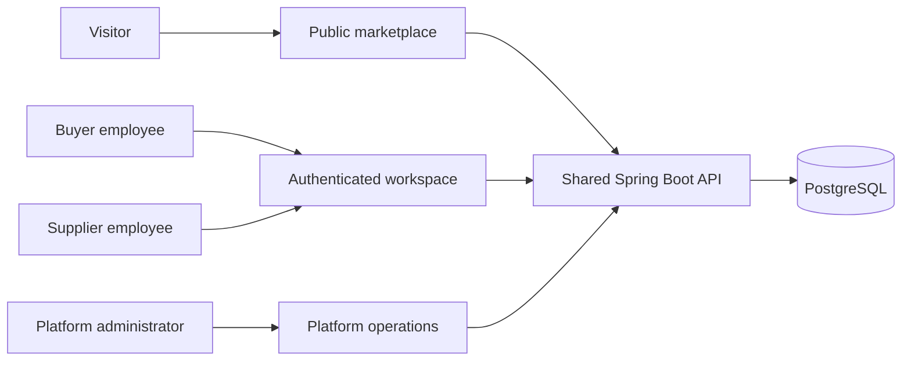
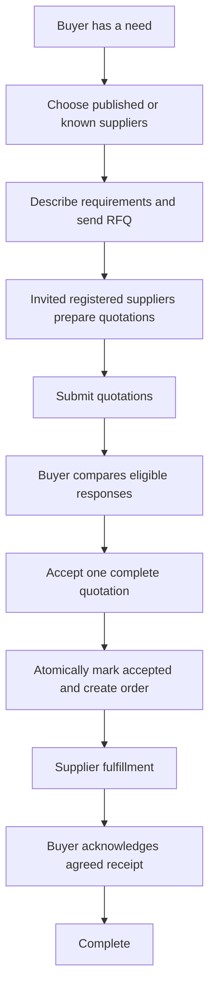
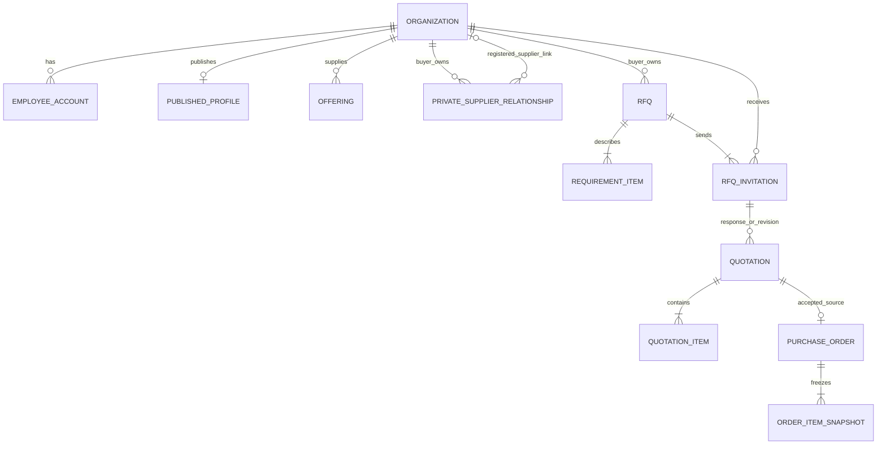

# ProcureFlow conceptual diagrams

Status: proposed design, not implemented schema or finalized states. Updated: 2026-10-09.

## System context - needed now

Question: who uses ProcureFlow, and where are the public/private boundaries?



All surfaces belong to one platform. Public discovery uses published projections; platform operations do not imply unrestricted procurement access. AI services are absent from MVP.

## Procurement activity - needed now

Question: how does discovery lead to one order?



Supplier confirmation, failure/cancellation branches and receipt rules are added when the relevant slice is specified.

## Conceptual data relationships - needed now

Question: which distinct business facts connect employees, RFQs, responses and orders?



This is a conceptual MCD, not a table-generation instruction. Platform accounts are excluded from employee-account cardinality. A private contact can be unlinked; pending unregistered RFQ-recipient handling is not modeled yet. Multiple quotation revisions are a candidate, not approved MVP behavior. An RFQ has at most one awarded quotation/order under the agreed one-winner policy; that cross-relationship invariant is not fully expressible in this diagram.

## Award sequence - needed before Slice 5 implementation

Question: how do acceptance and order creation avoid partial completion?

```mermaid
sequenceDiagram
  actor Buyer
  participant API
  participant Service as Award service
  participant DB as PostgreSQL
  Buyer->>API: Accept selected quotation
  API->>Service: Authenticated actor and quotation reference
  Service->>DB: Begin transaction; protect RFQ award state
  Service->>Service: Check buyer permission, quote eligibility and no winner
  Service->>DB: Set award and quotation ACCEPTED
  Service->>DB: Insert unique order and accepted item snapshots
  Service->>DB: Commit all changes
  Service-->>Buyer: Accepted quotation and created order reference
  Note over Service,DB: Failure rolls back both changes; competing awards cannot both win
```

## Diagram maintenance schedule

| Diagram | Question answered | Timing |
| --- | --- | --- |
| Identity use case and onboarding sequence | Who registers, joins and grants permissions? | Slice 1 |
| Component diagram | Which module owns each operation and dependency? | Update as modules appear |
| RFQ/quotation state machines | Which actors can make which transitions? | Slices 3-4, before enums/endpoints |
| Order state machine | What do confirmation, processing, receipt and completion mean? | Slice 6 |
| Physical ERD | What schema/constraints actually exist? | With each migration |
| Deployment | What runs where, with which trust boundaries? | Before a real deployment choice |
| AI data flow | Which authorized data reaches retrieval/models? | Only if AI slice is approved |

Update diagrams when implementation changes the represented behavior. Retain the explicit distinction between a proposed conceptual model and the implemented physical schema.
